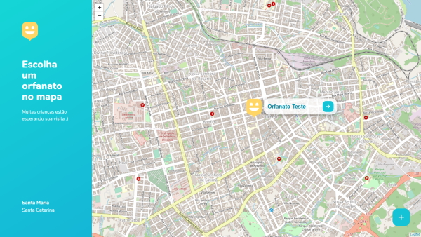

<h1 align="center">
   
  NLW3-Happy
</h1>

Projeto Happy desenvolvido na NLW#3 da Rocketseat

A aplicação Happy foi desenvolvida durante a terceira edição da Next Level Week da Rocketseat. Happy consiste em uma aplicação para encontrar, cadastrar e comunicar-se com Serviços de Acolhimento Institucional, com o objetivo de incentivar visitas às crianças presente nesses abrigos e lares.

